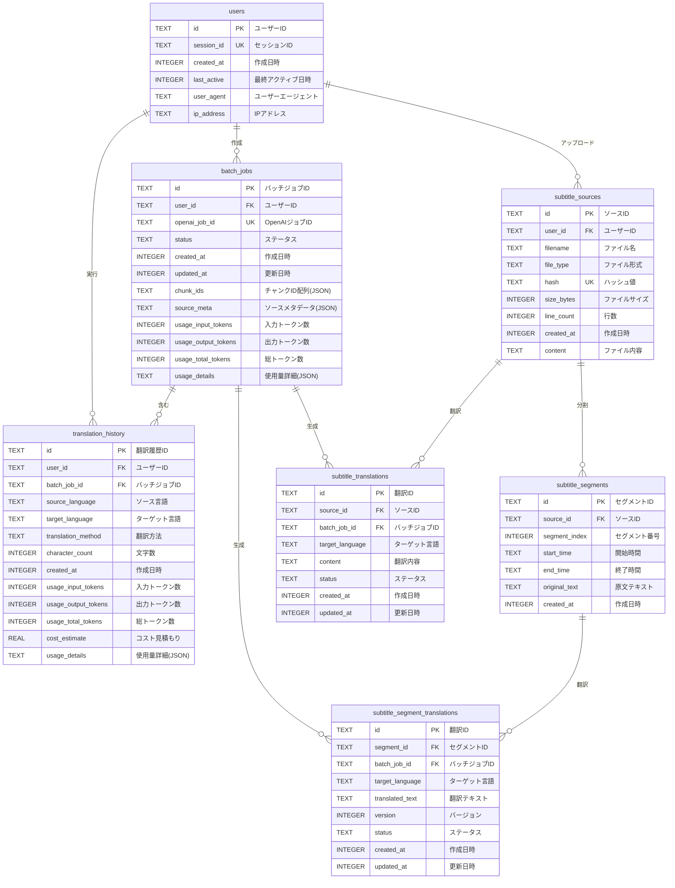

# データベーススキーマ ER図

## 現在のテーブル構成（7テーブル）



## テーブル詳細

### 1. **users** - ユーザー管理
- セッション管理とユーザー追跡
- プライバシー保護のためのIPアドレス記録

### 2. **batch_jobs** - バッチ翻訳ジョブ
- OpenAI Batch APIのジョブ管理
- トークン使用量とコスト追跡
- ソースファイルのメタデータ保存

### 3. **translation_history** - 翻訳履歴
- 翻訳実行の記録と分析
- コスト計算と使用量追跡

### 4. **subtitle_sources** - 字幕ソースファイル
- アップロードされた字幕ファイルの全体保存
- ファイル形式、サイズ、ハッシュ値の管理

### 5. **subtitle_segments** - 字幕セグメント ✨
- 個別の字幕エントリ（タイムスタンプ + テキスト）
- メディアプレイヤーでの時間軸表示に最適化

### 6. **subtitle_segment_translations** - セグメント翻訳 ✨
- セグメント単位の多言語翻訳
- バージョン管理で翻訳履歴を追跡

### 7. **subtitle_translations** - 翻訳結果（全文）
- 後方互換性のための全文翻訳保存
- 既存機能との互換性維持

## インデックス

- `idx_batch_jobs_user_id` - ユーザー別バッチジョブ検索
- `idx_batch_jobs_status` - ステータス別検索
- `idx_subtitle_segments_timing` - 時間範囲検索
- `idx_subtitle_segment_translations_language` - 言語別翻訳検索
- `uniq_segment_translation_latest` - 最新翻訳の一意性保証

## アプリサーバーでの利用例

```typescript
// 特定時間の字幕を取得
const segments = await db.query(`
  SELECT s.*, st.translated_text 
  FROM subtitle_segments s
  LEFT JOIN subtitle_segment_translations st 
    ON s.id = st.segment_id 
    AND st.target_language = 'ja'
  WHERE s.source_id = ? 
    AND s.start_time <= ? 
    AND s.end_time >= ?
  ORDER BY s.segment_index
`, [sourceId, currentTime, currentTime]);
```
